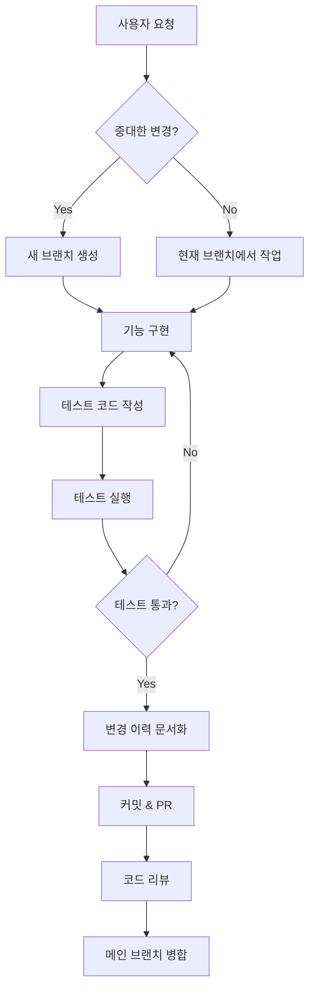

# 개발자 정책 지침 (Developer Policy Guidelines)

**작성일**: 2025-11-21  
**버전**: 1.0.0

---

## 📋 개요

본 문서는 Landing Page Design 프로젝트의 AI 개발 지원 시 준수해야 할 핵심 정책을 정의합니다.

---

## 1️⃣ 언어 정책

### 기본 규칙
- ✅ **모든 응답은 한국어로 제공**
- ✅ 코드 주석도 한국어로 작성
- ✅ 커밋 메시지는 한국어 우선 (필요시 영어 병기)

---

## 2️⃣ 참고 자료 명시

### 외부 라이브러리/알고리즘 사용 시

**의무 사항:**
- 사용된 라이브러리의 이름과 버전 명시
- 참고한 공식 문서 URL 표기
- 알고리즘 출처 (논문, 블로그, Stack Overflow 등)
- 라이선스 정보 확인 및 기록

**예시:**
```typescript
/**
 * 날짜 포맷팅 유틸리티
 * 
 * @library date-fns (v3.0.0)
 * @reference https://date-fns.org/docs/format
 * @license MIT
 */
import { format } from 'date-fns';
```

---

## 3️⃣ 수정 내용 표시

### 채팅창 표시 규칙

모든 코드 수정 시 다음 정보를 포함:

1. **수정 대상 파일 경로**
2. **변경 이유**
3. **수정 전/후 코드 비교**
4. **영향받는 다른 파일**

**예시 형식:**
```markdown
## 📝 수정 내용

### 파일: src/components/Button.tsx

#### 변경 이유
- 접근성 개선을 위해 ARIA 속성 추가

#### 수정 내용
- Before: <button onClick={...}>
- After: <button onClick={...} aria-label="..." role="button">

#### 영향 범위
- Button 컴포넌트를 사용하는 모든 페이지에 자동 적용
```

---

## 4️⃣ 테스트 코드 작성

### 필수 테스트 작성 대상

- ✅ 모든 신규 함수/메서드
- ✅ 비즈니스 로직을 포함한 컴포넌트
- ✅ API 엔드포인트
- ✅ 유틸리티 함수
- ✅ 상태 관리 로직

### 테스트 코드 위치
```
src/
├── components/
│   ├── Button.tsx
│   └── Button.test.tsx          # 컴포넌트 테스트
├── utils/
│   ├── formatDate.ts
│   └── formatDate.test.ts       # 유틸리티 테스트
└── hooks/
    ├── useAuth.ts
    └── useAuth.test.ts          # 훅 테스트
```

### 테스트 프레임워크
- **단위 테스트**: Vitest
- **컴포넌트 테스트**: React Testing Library
- **E2E 테스트**: Playwright (선택적)

---

## 5️⃣ 브랜치 관리 전략

### 중대한 변경 시 브랜치 생성

다음 경우 **필수적으로** 새 브랜치 생성:

#### 🔵 신기능 구현
```bash
# 브랜치 명명 규칙
feature/<기능명>

# 예시
feature/user-authentication
feature/payment-integration
```

#### 🟡 DB 구조 수정
```bash
# 브랜치 명명 규칙
db/<변경내용>

# 예시
db/add-user-roles-table
db/migration-v2
```

#### 🟢 UI 레이아웃 대규모 변경
```bash
# 브랜치 명명 규칙
ui/<변경내용>

# 예시
ui/redesign-homepage
ui/mobile-responsive-layout
```

#### 🟣 아키텍처 변경
```bash
# 브랜치 명명 규칙
refactor/<변경내용>

# 예시
refactor/migrate-to-typescript
refactor/state-management-zustand
```

### 브랜치 전략
```
main (production)
  ├── develop (development)
  │   ├── feature/new-feature
  │   ├── ui/redesign
  │   └── db/schema-update
  └── hotfix/critical-bug
```

---

## 6️⃣ 변경 이력 문서화

### history 폴더 구조
```
history/
├── 2025-11-21_초기-정책-설정.md
├── 2025-11-22_사용자-인증-구현.md
└── 2025-11-23_UI-레이아웃-개선.md
```

### 문서 명명 규칙
```
YYYY-MM-DD_<변경-내용-요약>.md
```

### 문서 템플릿

```markdown
# 변경 이력: [변경 내용 제목]

**날짜**: YYYY-MM-DD  
**작성자**: AI Assistant  
**브랜치**: feature/xxx  
**커밋**: abc1234

---

## 📋 사용자 요구사항

[사용자가 요청한 내용을 그대로 기록]

---

## 💬 AI 응답 내용

### 분석
[요구사항 분석 내용]

### 구현 계획
[구현 방법 및 순서]

---

## 🔧 수정 내용 상세

### 변경된 파일 목록
- [ ] src/...
- [ ] tests/...

### 주요 변경 사항

#### 1. 파일명
- **변경 이유**: 
- **변경 내용**: 
- **테스트 코드**: 

---

## 📊 테스트 결과

### 단위 테스트
```bash
npm test
# 결과 붙여넣기
```

### 빌드 확인
```bash
npm run build
# 결과 붙여넣기
```

---

## 📝 요약

- **변경된 파일**: X개
- **추가된 테스트**: Y개
- **영향받는 기능**: [목록]
- **주의사항**: [있다면 기록]

---

## 🔗 관련 링크

- PR: #xxx
- Issue: #xxx
- 참고 문서: [URL]
```

---

## 🚀 워크플로우

### 일반적인 개발 흐름



---

## 📌 체크리스트

개발 완료 전 확인 사항:

- [ ] 코드가 한국어로 문서화되었는가?
- [ ] 외부 라이브러리 출처가 명시되었는가?
- [ ] 변경 내용이 채팅에 명확히 표시되었는가?
- [ ] 테스트 코드가 작성되었는가?
- [ ] 테스트가 모두 통과하는가?
- [ ] 중대한 변경 시 브랜치가 생성되었는가?
- [ ] history 폴더에 변경 이력이 문서화되었는가?
- [ ] 커밋 메시지가 명확한가?

---

## 🔄 정책 업데이트

본 정책은 프로젝트 진행 중 필요에 따라 업데이트될 수 있습니다.

**업데이트 이력:**
- 2025-11-21: v1.0.0 초기 정책 수립

---

## 📞 문의

정책 관련 문의사항이나 개선 제안은 프로젝트 관리자에게 문의하세요.
